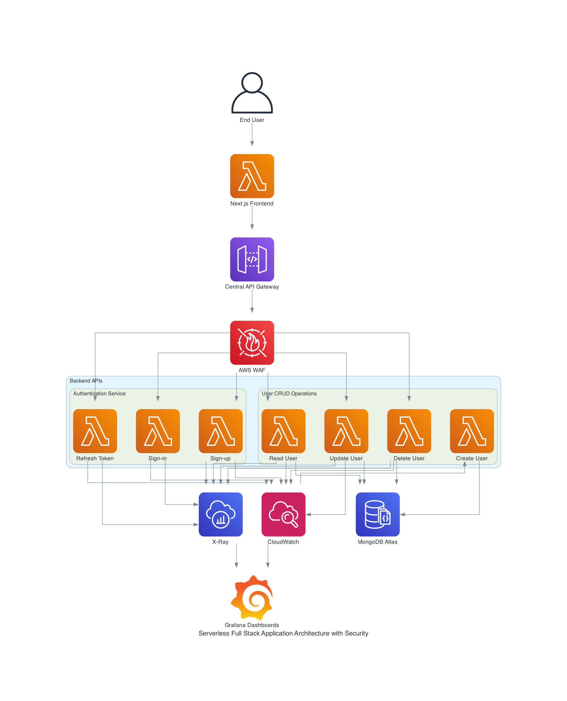

# Serverless Full-Stack Application Architecture Documentation

## Overview

This document outlines the architecture of a serverless full-stack application designed to leverage AWS services for
scalability, performance, and cost efficiency. The application utilizes a React-based Next.js framework for the frontend
and a serverless backend comprising AWS Lambda functions, orchestrated by Amazon API Gateway. The backend is built with
Node.js, utilizing Express.js within Lambda functions for routing. Authentication is managed via JWT tokens, with
Passport.js aiding in the authentication process. MongoDB Atlas serves as the database, providing a scalable and
flexible NoSQL storage solution. The application also incorporates comprehensive monitoring and logging solutions,
including AWS CloudWatch, AWS X-Ray, and Grafana, to ensure high observability.

## Architecture Components

### Frontend

- **Next.js Application**: A React framework that enables server-side rendering and static site generation for building
  highly performant user interfaces. The frontend is responsible for presenting the user interface and making API calls
  to the backend services through the Amazon API Gateway.

### Backend

- **Amazon API Gateway**: A fully managed service that makes it easy for developers to create, publish, maintain,
  monitor, and secure APIs at any scale. It acts as a single entry point for all backend API calls, routing requests to
  the appropriate Lambda function based on the configured routes.

- **AWS Lambda**: A compute service that lets you run code without provisioning or managing servers. Lambda executes
  your code only when needed and scales automatically.

	- **Authentication Service**:
		- *Sign-in*: Handles user authentication and token generation.
		- *Sign-up*: Manages new user registration and integrates with the user CRUD operations to create new user records
		  in the database.
		- *Refresh Token*: Provides token refreshing capabilities to maintain user sessions.

	- **User CRUD Operations**:
		- *Create User*: Manages the creation of new user records.
		- *Read User*: Retrieves user information.
		- *Update User*: Updates existing user records.
		- *Delete User*: Deletes user records from the database.

### Database

- **MongoDB Atlas**: A fully-managed cloud database service that hosts MongoDB databases, offering automated
  provisioning, scaling, and management of MongoDB instances.

### Monitoring and Logging

- **AWS CloudWatch**: Provides monitoring and operational data for AWS resources and applications, collecting logs,
  metrics, and events.

- **AWS X-Ray**: Helps developers analyze and debug distributed applications, such as those built using a microservices
  architecture. It provides request tracing to understand application flow and performance.

- **Grafana**: An open-source platform for monitoring and observability, integrated with CloudWatch and X-Ray to provide
  advanced data visualization through dashboards.

### Security

- **AWS WAF**: Integrated with Amazon API Gateway to inspect and filter incoming traffic against common web threats,
  ensuring robust security at the application's entry point.
- **Passport.js with JWT**: Utilized within Lambda functions to manage authentication and session management, employing
  JWT tokens for secure transmission of user credentials.

## Data Flow

1. **User Interaction**: End users interact with the Next.js frontend application, which makes HTTP requests to backend
   services through the Amazon API Gateway.

2. **API Gateway Routing**: The API Gateway routes incoming requests to the corresponding AWS Lambda function based on
   the request path and method.

3. **equest Filtering**: Incoming requests pass through AWS WAF at the API Gateway, where they are analyzed and filtered
   based on predefined security rules to block malicious traffic.

4. **Lambda Function Processing**: Lambda functions process the requests. Authentication-related requests are handled by
   the Authentication Service, while user-related operations are managed by the User CRUD Operations service.

5. **Database Interaction**: User CRUD operations interact with MongoDB Atlas for data storage and retrieval.

6. **Response**: Lambda functions send HTTP responses back to the frontend through the API Gateway, completing the
   request-response cycle.

7. **Monitoring and Logging**: All backend operations are monitored and logged using AWS CloudWatch and AWS X-Ray, with
   Grafana providing a unified dashboard for visualization and analytics.
